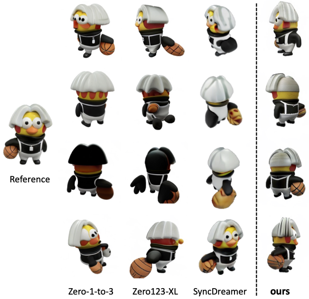
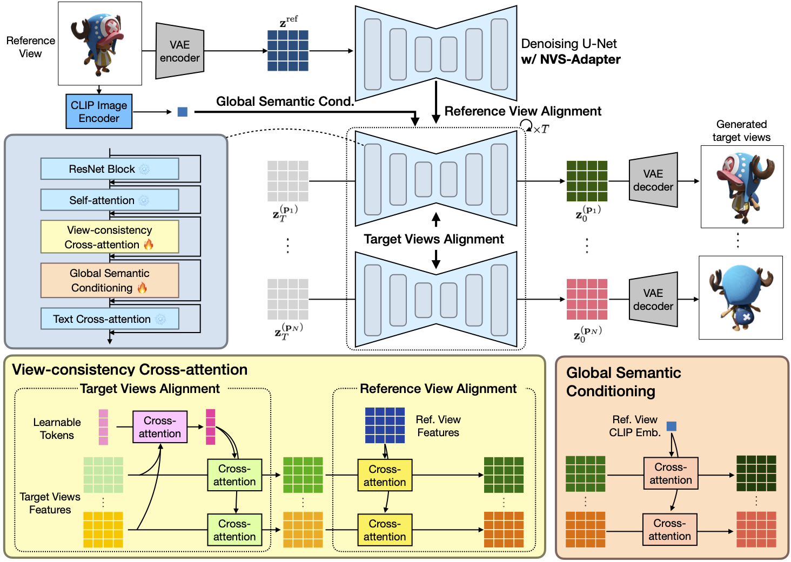

# NVS-Adapter: Plug-and-Play Novel View Synthesis from a Single Image

<p align="center">
  
</p>

## Abstract

Transfer learning of large-scale Text-to-Image (T2I) models has recently shown impressive potential for Novel View Synthesis (NVS) of diverse objects from a single image. While previous methods typically train large models on multi-view datasets for NVS, fine-tuning the whole parameters of T2I models not only demands a high cost but also reduces the generalization capacity of T2I models in generating diverse images in a new domain. In this study, we propose an effective method, dubbed NVS-Adapter, which is a plug-and-play module for a T2I model, to synthesize novel multi-views of visual objects while fully exploiting the generalization capacity of T2I models. NVS-Adapter consists of two main components; view-consistency cross-attention learns the visual correspondences to align the local details of view features, and global semantic conditioning aligns the semantic structure of generated views with the reference view. Experimental results demonstrate that the NVS-Adapter can effectively synthesize geometrically consistent multi-views and also achieve high performance on benchmarks without full fine-tuning of T2I models.

<p align="center">
  
</p>


## Preparation

### Installation

```shell
conda create -n nvs_adapter python=3.10 -c anaconda
conda activate nvs_adapter
pip3 install -r requirements.txt
```

### Pretrained Checkpoints

Our code requires several pretrained checkpoints depending on the model options. Our implementation assumes all the pretrained models are located inside the `checkpoints/` directory. 

As a default, our model uses **pretrained SD2.1 checkpoint** and you can manually download the file [here](https://huggingface.co/stabilityai/stable-diffusion-2-1-base/blob/main/v2-1_512-ema-pruned.safetensors) and put the file inside `./checkpoints/`. Otherwise, you can use the script below:
```
mkdir -p ./checkpoints
wget https://huggingface.co/stabilityai/stable-diffusion-2-1-base/resolve/main/v2-1_512-ema-pruned.safetensors?download=true -O ./checkpoints/v2-1_512-ema-pruned.safetensors
```

When you are training the model with **pretrained SD1.5 checkpoint**, you can instead use the file [here](https://huggingface.co/runwayml/stable-diffusion-v1-5/blob/main/v1-5-pruned-emaonly.ckpt). Otherwise, you can use the script below:
```
mkdir -p ./checkpoints
wget https://huggingface.co/runwayml/stable-diffusion-v1-5/resolve/main/v1-5-pruned-emaonly.ckpt?download=true -O ./checkpoints/v1-5-pruned-emaonly.ckpt
```

When combining our model with ControlNet, two more pretrained checkpoints are required.
- DPT Hybrid model: [here](https://github.com/intel-isl/DPT/releases/download/1_0/dpt_hybrid-midas-501f0c75.pt)
- ControlNet (Depth) SD1.5 model: [here](https://huggingface.co/lllyasviel/ControlNet/resolve/main/models/control_sd15_depth.pth?download=true)

```
mkdir -p ./checkpoints
wget https://github.com/intel-isl/DPT/releases/download/1_0/dpt_hybrid-midas-501f0c75.pt -O ./checkpoints/dpt_hybrid-midas-501f0c75.pt
wget https://huggingface.co/lllyasviel/ControlNet/resolve/main/models/control_sd15_depth.pth?download=true -O ./checkpoints/control_sd15_depth.pth
```

Double check that our model is compatible with ControlNet when the SD version is the same.

### Dataset

Download objaverse renderings from [Zero-1-to-3 repository](https://github.com/cvlab-columbia/zero123?tab=readme-ov-file#dataset-objaverse-renderings).

Convert objaverse renderings to WebDataset for training. As an example:
```
python3 scripts/objaverse_renderings_to_webdataset.py --paths_json_path=[path to json of file paths] --basepath=[basepath]

# Example
python3 scripts/objaverse_renderings_to_webdataset.py --paths_json_path=/data/objaverse/valid_paths.json --basepath=/data/objaverse/
```

We will soon release our GSO rendered dataset.

## Training

Following the implementation from [SD-XL](https://github.com/Stability-AI/generative-models), we can put multiple configuration files when running a script. As an example:
```
python3 main.py -b [config_path1] [config_path2] [config_path3] -- [config.key=new_val] [config.key=new_val]

# Example 
python3 main.py -b configs/base.yaml configs/ablation/camera_extrinsic.yaml configs/num_queries/2_queries.yaml -- trainer.devices=0, data.batch_size=4
```

Our 4-query base model:
```
python3 main.py -b configs/base.yaml
```

For more scripts for other experiments, please refer to the scripts below.
<details open>

  <summary>More scripts for training </summary>

  ```
  # Ours with learnable query scale 0.5 (Table 3)
  python3 main.py -b configs/base.yaml configs/ablation/query_emb_scale_half.yaml configs/num_queries/1_queries.yaml

  # Ours with learnable query scale 2.0 (Table 3)
  python3 main.py -b configs/base.yaml configs/ablation/query_emb_scale_2.yaml configs/num_queries/1_queries.yaml

  # Ours 1 query model (Table 4)
  python3 main.py -b configs/base.yaml configs/num_queries/1_queries.yaml

  # Ours 2 query model (Table 4)
  python3 main.py -b configs/base.yaml configs/num_queries/2_queries.yaml

  # Ours 6 query model (Table 4)
  python3 main.py -b configs/base.yaml configs/num_queries/6_queries.yaml

  # Ours w/o GSC (Table 5)
  python3 main.py -b configs/base.yaml configs/ablation/no_image_attn.yaml configs/num_queries/1_queries.yaml

  # Ours with ray offset and ray direction (Table 6)
  python3 main.py -b configs/base.yaml configs/ablation/rayo_rayd.yaml configs/num_queries/1_queries.yaml

  # Ours with extrinsic camera params (Table 6)
  python3 main.py -b configs/base.yaml configs/ablation/camera_extrinsic.yaml configs/num_queries/1_queries.yaml

  # Ours with full fine-tuning (Table 7)
  python3 main.py -b configs/base.yaml configs/options/full_finetune.yaml
  ```
</details>

## Evaluation

Ours pretrained 4 query model and config files can be downloaded with the scrips below.

```
mkdir -p ./checkpoints
wget https://twg.kakaocdn.net/brainrepo/models/nvsadapter/base_query_4_step_200000.ckpt -O ./checkpoints/base_query_4_step_200000.ckpt
wget https://twg.kakaocdn.net/brainrepo/models/nvsadapter/base_query_4.yaml -O ./checkpoints/base_query_4.yaml
```

You can synthesize novel view with the following script:
```
python3 scripts/novel_view_sampling.py --name nvs --input_image_path [path to image] --config_path [path to config] --ckpt_path [path to checkpoint] --elevations [elevation values in degree] --azimuths [azimuth values in degree] --cfg_scale [classifier free guidance scale in float] --use_ema

# Example
python3 scripts/novel_view_sampling.py --name nvs --input_image_path sample/deer.png --config_path checkpoints/base_query_4.yaml --ckpt_path checkpoints/base_query_4_step_200000.ckpt --elevations 0 0 0 0 --azimuths 30 60 90 120 --cfg_scale 3.0 --use_ema
```

## Demo

We also offer a demo that lets users easily test our model using any input image or viewpoint they choose.
To run the demo, you should first download the checkpoint and pass the downloaded path as an argument. 
You can simply run the gradio demo with the command below:
```
git submodule init
gradio demo.py --ckpt_path [path to ckpt]

# Example
gradio demo.py --config checkpoints/base_query_4.yaml --ckpt_path checkpoints/base_query_4_step_200000.ckpt 
```

## 3D Reconstruction using Score Distillation Sampling

We implemented score distillation sampling based on [threestudio](https://github.com/threestudio-project/threestudio).

Example script for score distillation sampling:
```
# in 3drec/
python3 launch.py --config configs/nvsadapter.yaml --train --gpu 0 data.image_path=[path to image]

# Example
python3 launch.py --config configs/nvsadapter.yaml --train --gpu 0 data.image_path=./load/images/a_beautiful_rainbow_fish_512_rgba.png
```

You can find the results in `3drec/outputs`.

## Licence

This project including the codes is distributed under the [MIT License](LICENSE-CODE), equivalent version of [Generative Models by Stability AI](https://github.com/Stability-AI/generative-models/blob/main/LICENSE-CODE), 
and the weights are distributed under the [Open RAIL++-M License](LICENSE-MODEL), equivalent version of [Stable Diffusion by Stability AI and Runway](https://github.com/CompVis/stable-diffusion/blob/main/LICENSE).

## Citation
If you find this research useful, please cite:
```
@article{jeong2023nvsadapter,
  title    = {NVS-Adapter: Plug-and-Play Novel View Synthesis from a Single Image},
  author   = {Yoonwoo Jeong, Jinwoo Lee, Chiheon Kim, Minsu Cho, and Doyup Lee},
  journal  = {arXiv preprint arXiv:2309.03453},
  year     = {2023}
}
```
